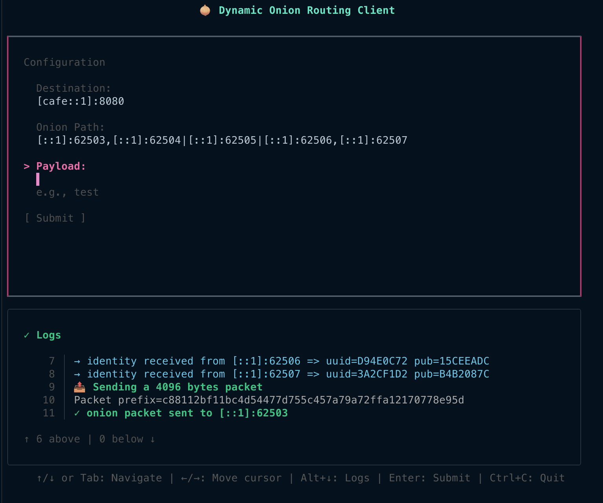

<h1 align="center"> DOR - Dynamic Onion Routing </h1>
<p align="center">
  <a href="https://go.dev/">
    
  </a>
  
  
  
</p>

DOR is a Go implementation of a dynamic onion routing protocol for anonymous network communication. It provides multi-layered encryption similar to Tor, with support for flexible path construction and relay selection.

This project was developed as part of the 3rd-year Networks & Computer Science semester project at ENSEIRB-MATMECA (France). This [French subject document](./docs/french_subject.pdf) details the objectives and specifications.

> [!WARNING]
> This is a research/educational implementation. For production anonymity needs, use established solutions like [Tor](https://www.torproject.org/).



## 🛠️ Features
- Multi-layer Onion Encryption: Each message is encrypted in multiple layers, with each relay peeling off one layer.
- Dynamic Path Selection: Flexible routing through multiple endpoint in relay groups.
- IPv4/IPv6 Support: Full dual-stack networking support.
- TUI Mode: Optional terminal UI for better visualization.
- Wireshark Integration: Lua plugin for protocol analysis.

## 📋 Prerequisites
- Go 1.25 or higher (required for CI execution)
- Network access for relay communication

## 🚀 Quick Start

### Installation
```bash
git clone https://github.com/Grolleau-Benjamin/Dynamic_Onion_Routing.git
cd Dynamic_Onion_Routing

go mod download
```

### Running the Server Daemon

Start a relay node:
```shell
go run cmd/dord/main.go
```

> Note: use `-h` to have information about available flags

### Running the Client

Basic Usage (CLI mode)

```bash
go run cmd/dorc/main.go \
  --dest "[::1]:8080" \
  --onion-path "[::1]:62503,127.0.0.1:62504|[::1]:62505" \
  --payload "Some data"
```

> Note: use `-h` to have information about available flags. This client sample also needs the three servers to be started.

Add `--tui` to have a terminal UI.

The `--onion-path` parameter defines the route through relay groups:
- Groups separated by `|`: Each group represents a layer in the onion
- Relays separated by `,`: Multiple relays in a group provide redundancy

Example:
```
  --onion-path "entryA:port,entryB:port|middleA:port|exitA:port,exitB:port"
```

## 📜 Documentation
All documentation can be found in the [docs](./docs) directory.

### Architecture
- [Client Cli Architecture](./docs/architecture/client_cli.md)
- [Client TUI Architecture](./docs/architecture/client_tui.md)

### Protocol Specifications
- [Onion Packet - Average Size Calculation](./docs/packet/OnionPacket_AverageSizeCalculation.md)

## 🔌 Wireshark Plugin
In addition to the demonstrator, this protocol also provides a Wireshark Lua plugin to observe DOR protocol exchanges.

Copy the plugin to your Wireshark plugins directory:

```shell
# Linux / Macos sample
cp ./tools/wireshark/dor.lua ~/.config/wireshark/plugins/

# Windows
cp ./tools/wireshark/dor.lua %APPDATA%/Wireshark/plugins/
```

> [!NOTE]
> The plugin does not decrypt ciphertext - it only displays the protocol structure visible on the network.
