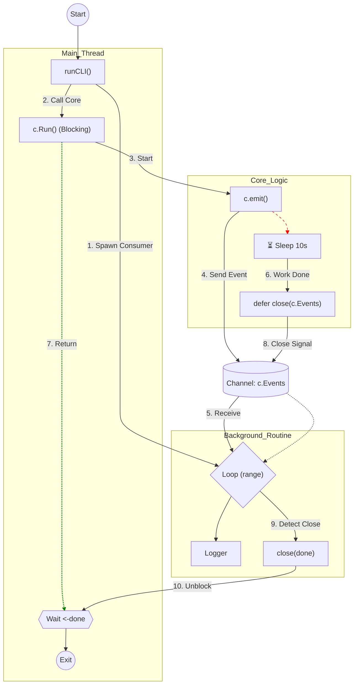

# Client Architecture and Concurrency Model

This document outlines the asynchronous architecture used in the `dorc` client CLI implementation. The system relies on a producer-consumer pattern using Go channels to ensure non-bloching UI update and graceful shutdowns.

A good commit to observe this behaviour is [91c1004](https://github.com/Grolleau-Benjamin/Dynamic_Onion_Routing/commit/91c1004420b9a5d9394feae388e8708e72f573c8)

## 1. Execution Flow (Sequence)

The following sequence diagram illustrates the lifecycle of the client, from the CLI initialization to the graceful shutdown triggered by channel closure.

```mermaid
sequenceDiagram
    autonumber
    participant Main as Main Thread (runCLI)
    participant Done as Done Chan
    participant Rout as Goroutine (Logger)
    participant EvCh as Events Chan
    participant Core as Client Core

    Note over Main, Rout: Phase 1 : Initialisation

    Main->>Rout: go func() { range c.Events }
    activate Rout
    
    Main->>Core: c.Run() (BLOCKING CALL)
    activate Core

    Note over Main: Main thread is blocked here...

    Note over Core, Rout: Phase 2 : Execution

    Core->>EvCh: emit("Client started...")
    EvCh->>Rout: receives Event
    Rout->>Rout: logEvent()
    
    rect rgb(40, 40, 40)
        Note right of Core: ⏳ SLEEP 10 SECONDS<br/>(Simulating work)
    end
    
    Note over Core, Rout: Phase 3 : Teardown

    Core-->>Main: return (End of Run)
    Core->>EvCh: defer close(events)
    deactivate Core
    
    Note over Main: Main moves to: <-done
    
    EvCh->>Rout: channel closed signal
    Rout->>Done: close(done)
    deactivate Rout
    
    Note over Main: Phase 4 : Exit
    
    Done->>Main: unblock
    Main->>Main: Program Exit
```

## Component Logic (Flowchart)

This flowchart details the interactions between the Main Thread, the Background Routine (Consumer), and the Core Logic (Producer).

