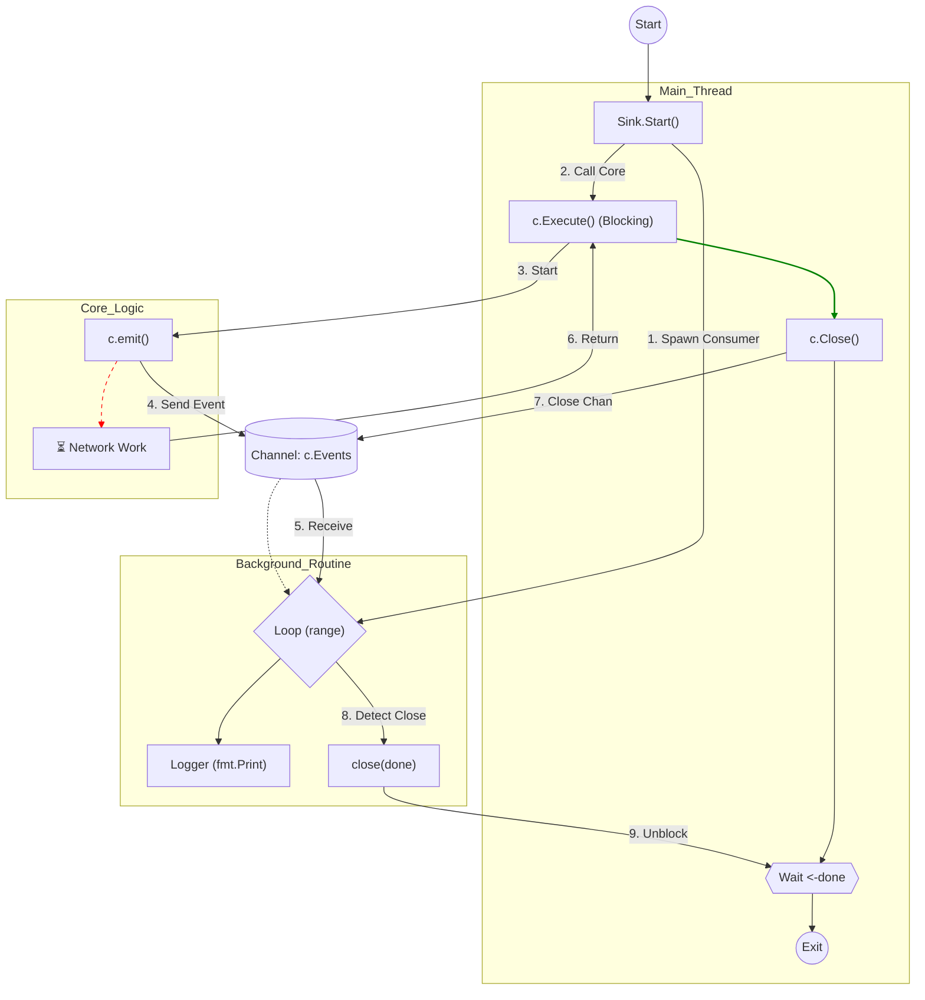

# Client Architecture and Concurrency Model

This document outlines the asynchronous architecture used in the `dorc` client CLI implementation. The system relies on a **Producer-Consumer pattern** with a "Wait for Completion" synchronization strategy to ensure non-blocking UI updates and graceful shutdowns.

**Current Reference Commit:** [9e112d0](https://github.com/Grolleau-Benjamin/Dynamic_Onion_Routing/commit/9e112d0a9c988ca94b99bea9663b4f707a89d374)

## 1. Execution Flow (Sequence)

The following sequence diagram illustrates the lifecycle of the client in Headless mode. The Main Thread acts as the controller, while a dedicated Goroutine handles logging to keep `stdout` responsive.

```mermaid
sequenceDiagram
    autonumber
    participant Main as Main Thread (Sink.Start)
    participant Done as Done Chan
    participant Rout as Goroutine (Logger)
    participant EvCh as Events Chan
    participant Core as Client Core

    Note over Main, Rout: Phase 1 : Initialization

    Main->>Rout: go func() { range c.Events }
    activate Rout

    Main->>Core: c.Execute() (BLOCKING CALL)
    activate Core

    Note over Main: Main thread is blocked here...

    Note over Core, Rout: Phase 2 : Execution

    Core->>EvCh: emit("Client started...")
    EvCh->>Rout: receives Event
    Rout->>Rout: logEvent()

    rect rgb(40, 40, 40)
        Note right of Core: ⏳ Client Logic Execution<br/>(Network I/O)
    end

    Note over Core, Rout: Phase 3 : Teardown

    Core-->>Main: return error (End of Execute)
    deactivate Core

    Main->>Core: c.Close()
    Core->>EvCh: close(events)

    Note over Main: Main moves to: <-done

    EvCh->>Rout: channel closed signal
    Rout->>Done: close(done)
    deactivate Rout

    Note over Main: Phase 4 : Exit

    Done->>Main: unblock
    Main->>Main: Return / Exit
```

## Component Logic (Flowchart)
This flowchart details the interactions between the Main Thread, the Background Routine (Consumer), and the Core Logic (Producer).

