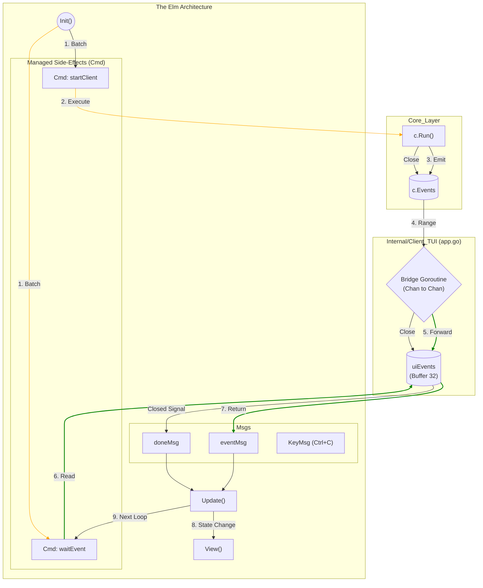

# TUI Architecture (Bubble Tea)

This document details the architecture of the interactive Terminal User Interface (TUI) mode. The TUI is built using the [Bubble Tea](https://github.com/charmbracelet/bubbletea) framework, implementing The Elm Architecture (Model-View-Update).

A good commit to observe this behaviour is [91c1004](https://github.com/Grolleau-Benjamin/
       ↪ Dynamic_Onion_Routing/commit/91c1004420b9a5d9394feae388e8708e72f573c8)

## 1. Overview

Unlike the blocking CLI mode, the TUI must remain responsive to user input while processing background events from the Core Client. To achieve this, we use a **Bridge Pattern** to decouple the Core's event channel from the UI's event loop.

### Key Concepts
- **The Bridge:** A dedicated goroutine in `app.go` pipes events from the Core `c.Events()` channel to a buffered UI channel. This ensures the UI never misses an event while rendering.
- **Recursive Commands:** The `waitEvent` command waits for a single event, delivers it to `Update()`, and then immediately schedules itself again. This creates a non-blocking listening loop.
- **Managed Side-Effects:** The Core client execution (`c.Run()`) is wrapped in a `tea.Cmd` to let the Bubble Tea runtime manage its lifecycle.

## 2. Lifecycle & Initialization (Sequence)

The following diagram illustrates how the application initializes. Note how the Core Logic runs in parallel with the UI rendering loop, connected only by the Bridge.

```mermaid
sequenceDiagram
    autonumber
    participant Main as Main Entry
    participant TUI as TUI App (app.go)
    participant Bridge as Bridge Routine
    participant Tea as BubbleTea Runtime
    participant Update as Model.Update()
    participant Core as Client Core

    Note over Main, Tea: Phase 1 : Initialization

    Main->>TUI: runTUI(client)
    TUI->>Bridge: go func() { pipe events }
    activate Bridge
    
    TUI->>Tea: NewProgram(model).Run()
    activate Tea
    
    Tea->>Tea: Call model.Init()
    Tea->>Core: Cmd: startClient() -> c.Run()
    activate Core
    Tea->>Bridge: Cmd: waitEvent() (Listening)

    Note over Core, Update: Phase 2 : Event Loop

    Core->>Bridge: emit(Event)
    Bridge->>Tea: send to uiEvents chan
    Tea->>Update: Msg: eventMsg
    Update->>Tea: return Cmd: waitEvent()
    
    Note over Tea: Re-render View

    rect rgb(40, 40, 40)
        Note right of Core: ⏳ Client Working...
    end

    Note over Core, Tea: Phase 3 : Termination

    Core-->>Tea: c.Run() finishes
    deactivate Core
    Core->>Bridge: close(c.Events)
    Bridge->>Tea: close(uiEvents)
    deactivate Bridge
    
    Tea->>Update: Msg: doneMsg
    Update->>Update: set done=true
    
    Note over Tea: User presses Ctrl+C
    Tea->>Main: Program Exit
    deactivate Tea
```

## The "Elm Architecture" Data Flow

This flowchart details the circular data flow within the TUI components. It highlights how the `Init()` function kickstarts two parallel processes: the Client execution and the Event Listener loop.

