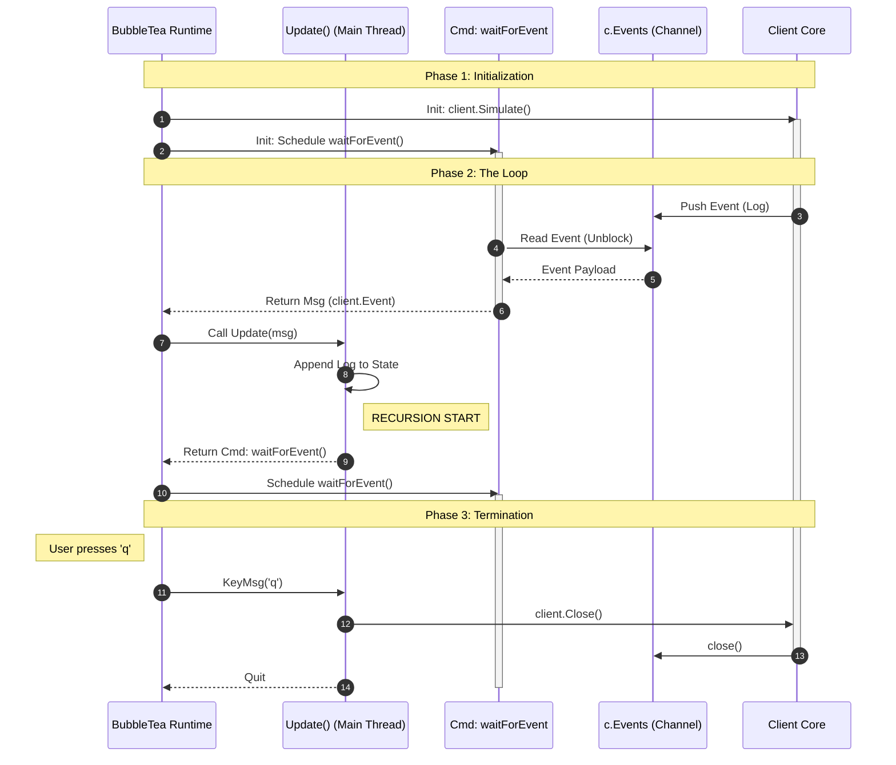
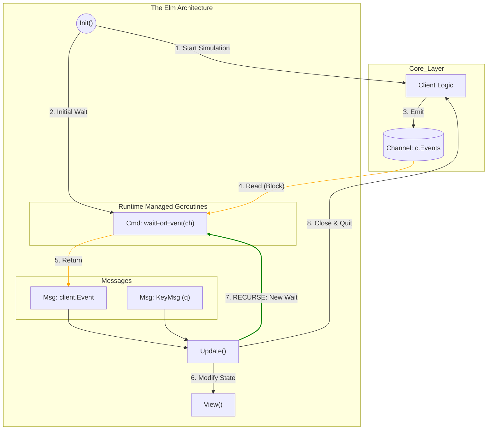

# TUI Architecture (Bubble Tea)

This document details the architecture of the interactive Terminal User Interface (TUI) mode. The TUI is built using the [Bubble Tea](https://github.com/charmbracelet/bubbletea) framework, strictly following the **Model-View-Update (MVU)** pattern.

**Current Reference Commit:** [9e112d0](https://github.com/Grolleau-Benjamin/Dynamic_Onion_Routing/commit/9e112d0a9c988ca94b99bea9663b4f707a89d374)

## 1. Overview

The TUI must remain responsive (60fps) while processing asynchronous background events from the Core Client. We achieve this using the **Recursive Command Pattern**.

### Key Concepts
- **Direct Command Integration:** Instead of a separate "bridge" goroutine, we use a `tea.Cmd` function (`waitForEvent`) that blocks on the channel read.
- **Bubble Tea Concurrency:** The Bubble Tea runtime executes `tea.Cmd` functions in its own managed goroutines.
- **Recursive Loop:** When an event is received in `Update()`, the model immediately issues a *new* `waitForEvent` command to listen for the next one. This creates an infinite listening loop without blocking the UI thread.

## 2. File Structure (MVU)

- **`model.go`**: Entry point. `Init()` kicks off the client simulation and the first listener command.
- **`state.go`**: Pure data structure holding the `Client` reference and UI logs.
- **`update.go`**: Handles `KeyMsg` (User input) and `client.Event` (Network events).
- **`view.go`**: Renders the state string using `strings.Builder`.

## 3. Lifecycle & Event Loop (Sequence)

The following diagram illustrates how the `waitForEvent` command acts as the glue between the Go Channel and the Bubble Tea Update loop.

## The "Recursive Command" Data Flow
This flowchart shows the circular nature of the event handling. Notice how Update() is responsible for re-arming the listener.

